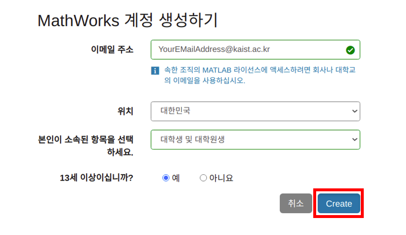
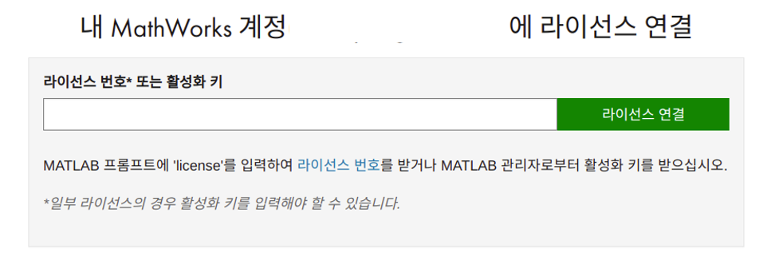
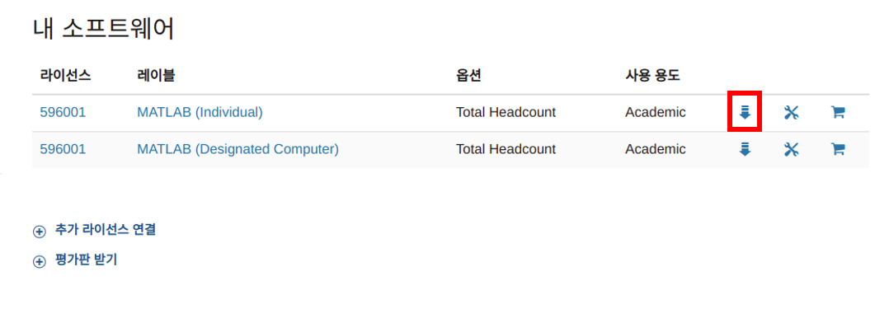
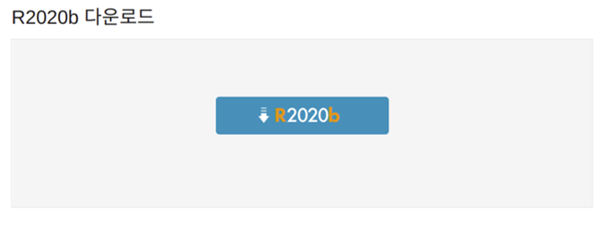
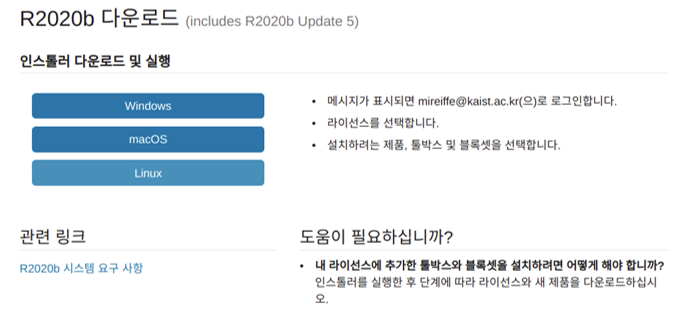

# 매트랩 설치 가이드
## 머릿말
이 문서는 KAIST의 학생들에게 무료로 제공되는 Total Academic Headcount (TAH)을 이용해 MATLAB을 설치 및 활성화하는 방법을 설명하고 있습니다.

## Mathworks 계정 생성
1. [Mathworks 홈페이지](https://www.mathworks.com)를 방문하여 계정 생성 페이지로 이동하세요: [로그인] - [[지금 만드세요!](https://kr.mathworks.com/mwaccount/register)].

    </img>

2.  가입시에 반드시 **KAIST 이메일 주소**를 이용해야 합니다..

    </img>

3.  이메일을 인증하여 가입을 완료하세요.\
    (인증시에 라이센스 입력란은 비워두셔도 됩니다.)

    </img>

## KAIST TAH 라이센스 등록
1.  생성한 아이디를 이용해 Mathworks 사이트에 로그인하고, 오른쪽 위에 위치한 [내 계정](https://kr.mathworks.com/mwaccount/)을 클릭하세요.

    </img>

2.  KAIST TAH 라이센스를 연결하기 위해 [연결]을 클릭하세요.

    </img>

3.  KAIST TAH 활성화 키를 입력하세요.\
    (활성화 키는 [[KFTP](https://kftp.kaist.ac.kr)] - [Serial] - [ETC S/W] 에서 얻을 수 있습니다.)

    </img>

4.  성공적으로 라이선스를 연결하였습니다.

    </img>

## 다운로드
1. [Mathworks 홈페이지](https://www.mathworks.com)의 [내 계정](https://kr.mathworks.com/mwaccount/)으로 이동하세요.

2.  **제품 다운로드**를 클릭하세요.

    </img>

3.  R2020b를 선택합니다.

    </img>

4. 개인 컴퓨터 환경에 맞는 인스톨러를 다운로드 하세요.

    </img>

## 설치
1. MATLAB 인스톨러를 실행하고, 계정과 비밀번호를 입력하세요.\
    (반드시 KAIST 이메일 주소를 입력해야 합니다.)

    </img>

2. 라이센스를 선택하세요.

    </img>

3.  설치하려는 제품들을 선택하세요.
    (MAS109에서 요구되는 제품은 'MATLAB'입니다.)

    </img>

5. 설치하려는 제품 목록을 확인하세요. 확인하면 설치가 시작됩니다. 

    </img>
