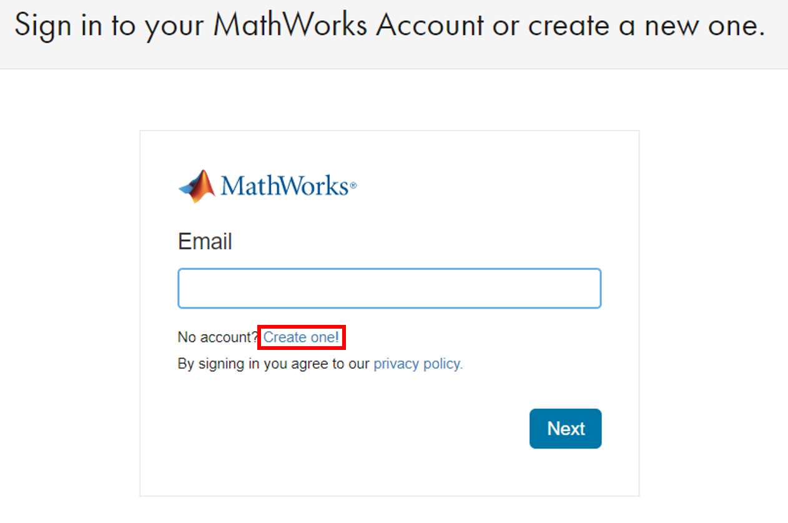
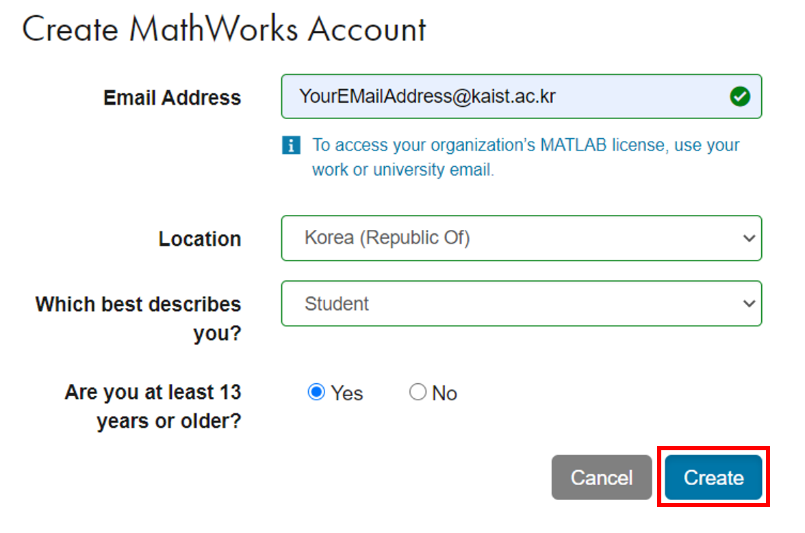
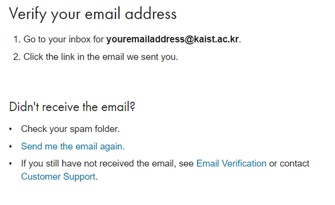
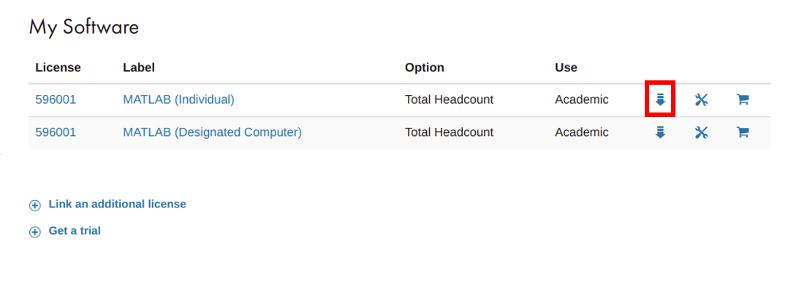
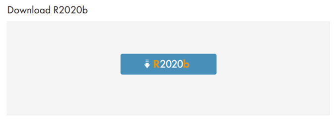
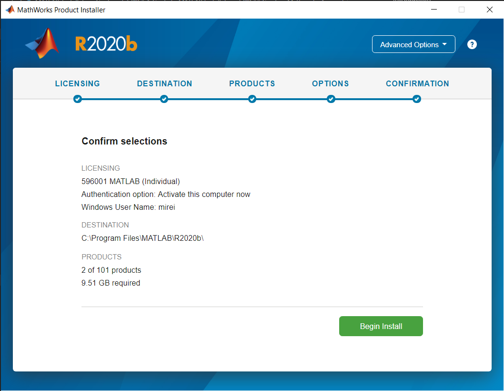

# **A Guide for MATLAB Installation**

## Introduction
This document describes how to install MATLAB using 'Total Academic Headcount (TAH)'. The TAH is a free academic license for KAIST students.

## Create a Mathworks Account
1. Visit the [Mathworks website](https://www.mathworks.com) and go to the sign up page: [Sign in] - [[Create One!](https://kr.mathworks.com/mwaccount/register)].

    </img>

2.  You should use your **KAIST email address**.

    </img>

3.  To complete creation, verify your email address by
    checking the email inbox.\
    (You can leave the license field empty.)

    </img>

## Register the KAIST TAH license
1.  Sign in the mathworks website using your created account and click [My Account](https://kr.mathworks.com/mwaccount/) in upper right corner

    </img>

2.  Click on the [Link] to add the KAIST TAH license
    to your account.

    </img>

3.  Enter the activation key for the KAIST TAH license.\
    (The activation key can be obtained from [[KFTP](https://kftp.kaist.ac.kr)] - [Serial] - [ETC S/W].)

    </img>

4.  You have successfully associated your account with the KAIST TAH license.

    </img>

## Download
1. Go to the [My Account](https://kr.mathworks.com/mwaccount/) in the [Mathworks website](https://www.mathworks.com).

2.  Click **Download Products**.

    </img>

3.  Click the R2020b button.

    </img>

4. Choose your computer platform then download will be started.

    </img>

## Installation
1.  Run the MATLAB installer. Enter your mathworks account and password.\
    (You should enter the KAIST email address.)

    </img>

2. Select license and move on.

    </img>

3.  Select the products.
    (The only product you need for MAS109 is 'MATLAB'.)

    </img>

5. Confirm the list of products what you select. This is the final
    confirmation before installation process which will
    take a time.

    </img>
