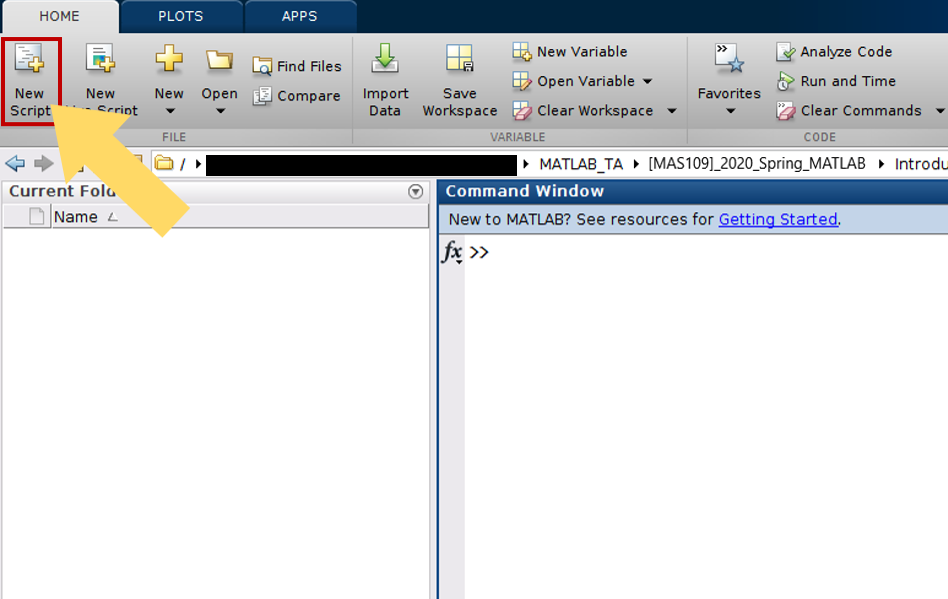
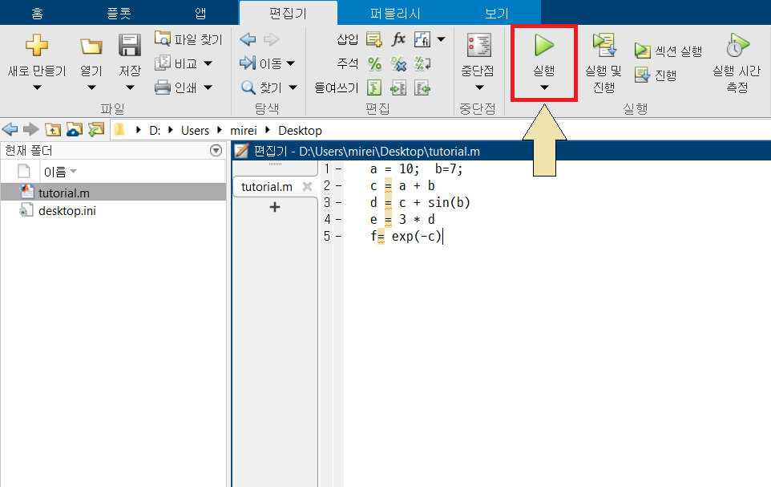

# MATLAB Tutorial

## Introduction

MATLAB (matrix laboratory) is a fourth-generation high-level programming language and an interactive environment for numerical computation, visualization and programming. MATLAB is developed by [MathWorks](http://www.mathworks.com). It allows matrix manipulations; plotting of functions and data; implementation of algorithms; creation of user interfaces; interfacing with programs written in other languages, including C, C++, Java, and FORTRAN; analyzing data; developing algorithms; and creating models and applications. It has numerous built-in commands and math functions that help you in mathematical calculations, generating plots, and performing numerical methods.

## 1. Understanding the MATLAB Environment
 </img>

- **Current Folder** allows you to access the project folders and files.

- **Command Window** is the main area where commands can be entered at the command line. It is indicated by the command prompt ( `>>` ).

- **Workspace** shows all the variables created and/or imported from files.

- **Command Hostory** shows or rerun commands that are entered at the command line.

## 2. Basic Syntax

MATLAB environment behaves like a super-complex calculator. You can enter commands at the `>>` command prompt.

Type a valid expression, for example,

```Matlab
>> 5 + 5
```

And press ENTER.

Then MATLAB executes it immediately and the result returned is:

```
ans =

        10
```

Let us take up more examples:

```Matlab
>> 4^2                  % 4 raised to the power of 2
```

And press ENTER.

Then MATLAB executes it immediately and the result returned is:

```
ans =

        16
```

Another example,

```Matlab
>> sin ( pi / 2 )       % sine of angle 90 degree
```

And press ENTER.

Then MATLAB executes it immediately and the result returned is:

```
ans = 

        1
```

Another example,

```Matlab
>> 7 / 0                % divide by zero
```

And press ENTER.

Then MATLAB executes it immediately and the result returned is:

```
ans =

        Inf
```

`Semicolon (;)` indicates end of statement. However, if you want to suppress and hide the MATLAB output for an expression, add a semicolon after the expression.

For example,

```Matlab
>> x = 3 ;
>> y = x + 5
```
```
y =

        8
```

`The percent symbol (%)` is used for indicating a comment line.
For example,

```Matlab
>> x = 9         % assign the value 9 to x
```
MATLAB will execute the above statement and return the following
result:

```
x =

        9
```

## 3. Variables

In MATLAB environment, every variable is an array or a matrix.
You can assign a variable in a simple way. For example,

```Matlab
>> x = 5         % defining x and initializing it with a value
```

It creates a 1-by-1 matrix named x and stores the value 9 in its
element. Let us check another example,

```Matlab
>> x = sqrt ( 25 )
```

MATLAB will return the following result:

```
x =

        5
```

Note that once a variable is entered into the system, you can refer
to it later and variables must have values before they are used.
When an expression returns a result that is not assigned to any
variable, the system assigns it to a variable named `ans`, which
can be used later.

For example,

```Matlab
>> sqrt( 78 )
```

MATLAB will return the following result:

```
ans =

        8.8318
```

You can have **multiple assignments** on the same line. For example

```Matlab
>> x = 2;
>> y = 77;
>> z = x * y
```

MATLAB will return the following result:

```
z =

        154
```

If you forget the variables, then type `who` in the command prompt

```Matlab
>> who
```

Then MATLAB will show your variable names.

If you want to display a little more about the varibles, type
`whos` in the command prompt:

```Matlab
>> whos
```

Then MATLAB will show your variable names, variables currently in
memory, types of variables, memory allocated to each variables, and
whether they are complex variables or not.

The `clear` command deletes all (or the specified) variable(s)
from the memory.

```Matlab
>> clear x              % it will delete x, won't display anything
>> clear                % it will delete all variables in the workspace
```

By default, MATLAB displays numbers with four decimal place values.
This is known as *short format*. However, if you want more
precision, you need to use the `format` command.

Check by yourself:

```Matlab
>> format long; x=pi
>> format short; x=pi
>> format bank; x=pi
>> format short e; x=pi
>> format long e; x=pi
>> format rat; x=pi
```

MATLAB allows **creating vectors** of two types: row vectors, column
vectors.

**Row vectors** are created by enclosing the set of elements in
square brackets, using space or comma to delimit the elements. For
example,

```Matlab
>> r = [3  5  7  9  11]
```

MATLAB will return the following result:

```
r =

     3    5    7    9    11
```

Another example,

```Matlab
>> v = [ 7  9  11  13  15 ];
>> w = [ 1,  3,  4,  5,  0 ];
>> z = v + w
```

MATLAB will return the following result:

```
z =

     8    12    15    18    15
```

**Column vectors** are created by enclosing the set of elements in
square brackets, using semicolon (;) to delimit the elements. For
example,

```Matlab
>> c = [3;  5;  7;  9;  11]
```

MATLAB will return the following result:

```
c =

     3
     5
     7
     9
    11
```

MATLAB allows **creating matrices**.

In MATLAB, a matrix is created by entering each row as a sequence of
space or comma separated elements, and the end of a row is
demarcated by a semicolon. For example, let us create a 3-by-3
matrix as:

```Matlab
>> M = [ 1   2   3 ; 4   5   6 ; 7   8   9 ]
```

MATLAB will return the following result:

```
M =

     1     2     3
     4     5     6
     7     8     9
```

## 4. M-files
So far, we have learned about MATLAB environment as a
calculator. However, MATLAB is also a powerful programming language,
as well as an interactive computational environment.

MATLAB allows writing two kinds of program files:

-  **Scripts** - script files are program files with **.m
    extension**. In these files, you write series of commands, which
    you want to execute together. Scripts do not accept inputs and
    do not return any outputs. They operate on data in the
    workspace.

-  **Functions** - function files are also program files with **.m
    extension**. Functions can accept inputs and return outputs.
    Internal variables are local to the function.

To create scripts files, you open the MATLAB editor in two ways:

-  using the command prompt

-  using the IDE.

If you are using the command prompt, type `edit` in the command
prompt. Type the follwing code in the editor:

```Matlab
>> mkdir myMATLAB           % create directory myMATLAB in currnet directory
>> chdir myMATLAB           % changing the current directory to my MATLAB
>> edit test1.m             % creating an m-file named test1.m
```

If you are creating a file for first time, MATLAB prompts you to
confirm it. Click `[YES]`.

Alternatively, if you are using the IDE, choose `[New Script]`.\
</img>

Type the following code in the editor:

```Matlab
a = 10;  b=7;
c = a + b
d = c + sin(b)
e = 3 * d
f= exp(-c)
```

After creating and saving the file, you can run it in two ways:

- Clicking the `[Run]` button on the editor window\
</img>

- Just typing the file name (without extension) in the command
    prompt:\
    </img>

When the above code is compiled and executed, it produces the
folliwing result:

```
c =

    17


d =

   17.6570


e =

   52.9710


f =

   4.1399e-08
```

## 5. Help
In MATLAB, you can find a description of functions by typing `help` in the command prompt:

```Matlab
>> help;
>> help rand;
```

What is function of the command `rand`?